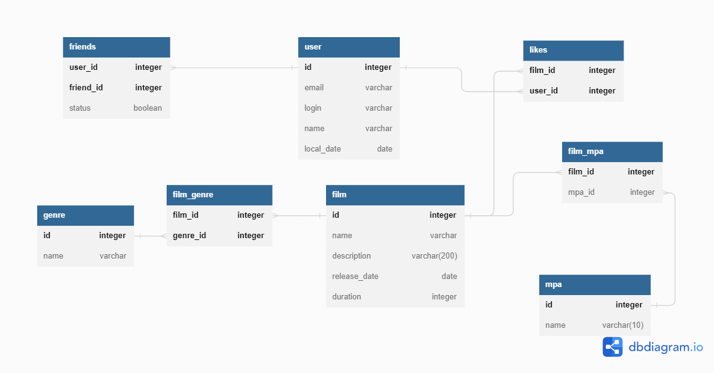

# Description of Filmorate project.


## Illustration of db scheme for the project:



I have used the following tool - [dbdiagram](https://dbdiagram.io) to designe the schema and create web-based database documentation using DSL code.

### Below is DBML code snippet for the scheme:
```sql
// Use DBML to define your database structure
// Docs: https://dbml.dbdiagram.io/docs
Project filmorate {
  database_type: 'PostgreSQL'
  Note: 'Task 11'
}

Table user {
  id integer [pk, increment]
  email varchar [not null]
  login varchar [not null]
  name varchar
  local_date date
}

Table friends {
  user_id integer 
  friend_id integer
  status boolean
    indexes {
      (user_id, friend_id) [pk]
  }
}
Table film {
  id integer [pk, increment]
  name varchar 
  description varchar(200)
  release_date date    
  duration integer 
  mpa_id integer   
}
Table likes {
  film_id integer
  user_id integer  
  indexes {
      (film_id, user_id) [pk]
  }
}

Table film_genre {
  film_id integer
  genre_id integer
    indexes {
      (film_id, genre_id) [pk]
  }
}

table mpa {
  id integer [pk]
  name varchar(10)
}

table film_mpa {
  film_id integer [pk]
  mpa_id integer
}

table genre {
  id integer [pk]
  name varchar
}

Ref: film_mpa.mpa_id > mpa.id
Ref: film_mpa.film_id > film.mpa_id
Ref: genre.id < film_genre.genre_id
Ref: film_genre.film_id > film.id
Ref: user.id < friends.user_id
Ref: film.id < likes.film_id
Ref: user.id < likes.user_id

```

### Below is Postgre SQL DDL code snippet for the scheme:

```sql
DROP TABLE IF EXISTS "user" CASCADE;
DROP TABLE IF EXISTS "friends" CASCADE;
DROP TABLE IF EXISTS "likes" CASCADE;
DROP TABLE IF EXISTS "genre" CASCADE;
DROP TABLE IF EXISTS "film" CASCADE;
DROP TABLE IF EXISTS "film_mpa" CASCADE;
DROP TABLE IF EXISTS "mpa" CASCADE;
DROP TABLE IF EXISTS "film_genre" CASCADE;

CREATE TABLE IF NOT EXISTS "user" (
  "id" INTEGER GENERATED BY DEFAULT AS IDENTITY PRIMARY KEY,
  "email" varchar CHECK ("email" ~* '^[A-Za-z0-9._+%-]+@[A-Za-z0-9.-]+[.][A-Za-z]+$') NOT NULL,
  "login" varchar NOT NULL,
  "name" varchar NOT NULL,
  "birthday" date CHECK("birthday" < now())
);

CREATE TABLE IF NOT EXISTS "film" (
  "id" INTEGER GENERATED BY DEFAULT AS IDENTITY PRIMARY KEY,
  "name" varchar  NOT NULL,
  "description" varchar(200),
  "release_date" date CHECK ("release_date" > '1895-12-28'),
  "duration" integer CHECK ("duration" > 0)
);

CREATE TABLE IF NOT EXISTS "friends" (
  "user_id" integer,
  "friend_id" integer,
  "status" BOOLEAN DEFAULT FALSE,
  PRIMARY KEY ("user_id", "friend_id")
);

CREATE TABLE IF NOT EXISTS "likes" (
  "film_id" integer,
  "user_id" integer,
  PRIMARY KEY ("film_id", "user_id")
);

CREATE TABLE IF NOT EXISTS "genre" (
  "id" integer PRIMARY KEY,
  "name" varchar
);

CREATE TABLE IF NOT EXISTS "film_genre" (
    "film_id" integer,
    "genre_id" integer,
     PRIMARY KEY ("film_id", "genre_id")
);

CREATE TABLE IF NOT EXISTS "film_mpa" (
    "film_id" integer PRIMARY KEY,
    "mpa_id" integer
);

CREATE TABLE IF NOT EXISTS "mpa" (
    "id" integer GENERATED BY DEFAULT AS IDENTITY PRIMARY KEY,
    "name" varchar
);


ALTER TABLE PUBLIC."friends" ADD CONSTRAINT IF NOT EXISTS FRIENDS_FK FOREIGN KEY ("user_id") REFERENCES "user"("id") ON UPDATE CASCADE ON DELETE CASCADE;
ALTER TABLE "film_genre" ADD CONSTRAINT IF NOT EXISTS GENRE_NAME_FK FOREIGN KEY ("genre_id") REFERENCES "genre"("id") ON UPDATE CASCADE ON DELETE CASCADE;
ALTER TABLE "film_genre" ADD CONSTRAINT IF NOT EXISTS FILM_GENRE_FK FOREIGN KEY ("film_id") REFERENCES "film"("id") ON UPDATE CASCADE ON DELETE CASCADE;
ALTER TABLE "likes" ADD CONSTRAINT IF NOT EXISTS LIKES_FILM_FK FOREIGN KEY ("film_id") REFERENCES "film"("id") ON UPDATE CASCADE ON DELETE CASCADE;
ALTER TABLE "likes" ADD CONSTRAINT IF NOT EXISTS LIKES_USER_FK FOREIGN KEY ("user_id") REFERENCES "user"("id") ON UPDATE CASCADE ON DELETE CASCADE;
ALTER TABLE "film_mpa" ADD CONSTRAINT IF NOT EXISTS FILM_MPA_FK FOREIGN KEY ("mpa_id") REFERENCES "mpa"("id") ON UPDATE CASCADE ON DELETE CASCADE;
ALTER TABLE "film_mpa" ADD CONSTRAINT IF NOT EXISTS MPA_FILM_FK FOREIGN KEY ("film_id") REFERENCES "film"("id") ON UPDATE CASCADE ON DELETE CASCADE;
```

### Below is some examples of sql query for the illustrated BD:
1) Get friends ids by userId:
```sql
SELECT * 
FROM friends f
WHERE f.user_id = userId AND f.status = TRUE
```
2) Get user likes count:
```sql
SELECT count(*)
FROM likes l
WHERE user_id = userId
```